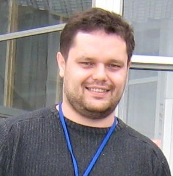

Сотник Сергей Леонидович. Родился 30 апреля 1974 года.  

## Образование

Высшее, Днепродзержинский Государственный Технический Университет. Инженер-электрик. Тема диплома: “Разработка и исследование искусственной нейронной модели котлоагрегата как объекта управления”.

Окончил аспирантуру в Днепродзержинском Государственном Техническом Университете по специальности 01.01.01 – “Мат. анализ”.

## Разное

Третье место на всеукраинской математической олимпиаде студентов, грант  
Соросовского фонда поддержки образования в области точных наук (ISSEP, грант №GSU051376). Есть публикации.

## Профессиональные навыки

Профессионально программирую с 1994 года. Сейчас основной язык программирования - Python. Ранее использовал: C# (.Net), Delphi (имеется сертификат о сдаче экзамена BrainBench Certified Delphi Master Programmer), Java. Кроме того, знаком (хотя и не использую активно в повседневной практике) со многими другими языками: C/C++, JavaScript, Visual Basic и др.  
Последнее время работаю в области Computer Linguistic. Не являюсь лингвистом по образованию. Скорее, применяю в данной области знания из смежных областей – ИИ, статистика и т.п. Последние проекты, в реализации которых принимал участие (во время работы в NeuroPower Technologies GmbH): NeuroPower GMDHLib, NeuroPower Content Surveyor, NeuroPower Digest, NeuroPower Superior Search. Демонстрационные версии этих продуктов доступны для загрузки с сайта [www.neuropower.de](http://www.neuropower.de/). В Alpha-Logic/ATEPEQ работал в области обработки сигналов (изображения, видео, изображения текстов, медицинские данные и т.д.). Также немного поработал в области спутниковой навигации – навигационное приложение для Pocket PC со встроенным GPS-приемником, LPS Ariadne.  
После перехода в Iveonik Systems, опять в основном работал в области компьютерной лингвистики + менеджмент.
В (P1k)[https://p1k.org/] в основном сосредоточился на технологической составляющей машинного обучения и организации получения данных для него. Python, deep learning frameworks, transformers, организация аннотирования.
Родные языки – русский, украинский. English - intermediate.

## Область научных интересов

Самоорганизация, мягкие вычисления (нейронные сети, эволюционные алгоритмы), анализ и визуализация многомерных данных, NLU/NLP.

## Места работы:

- 1994 Май – 1995 Май. Программист. Бухгалтерия ГОРОНО г. Днепродзержинска.
- 1996 Февраль – 1997 Сентябрь. Программист. Фирма Алиса. [www.alicetele.com](http://www.alicetele.com/).
- 1997 Сентябрь – 2000 Январь. Инженер-программист. ЗАО “Спецтехоснастка”. [www.d-sto.com](http://www.d-sto.com/)
- 1997 Сентябрь – 1999 Март. Старший преподаватель кафедры ПОВТ Днепродзержинского государственного технического университета. Дисциплины: “Основы проектирования систем с искусственным интеллектом”, “Операционные системы и системное программирование”. [www.dstu.dp.ua](http://www.dstu.dp.ua/).
- 2000 Январь – 2005 Январь. Программист. NeuroPower GmbH. [www.neuropower.de](http://www.neuropower.de/).
- 2005 Февраль – 2006 Август. Ведущий программист. Alpha-Logic. [www.alpha-logic.com.ua](http://www.alpha-logic.com.ua/).
- 2004 Сентябрь – 2005 Сентябрь. Ассистент кафедры ПОВТ Днепродзержинского государственного технического университета. Дисциплины: “Основы проектирования систем с искусственным интеллектом”, “Архитектура ЭВМ”. [www.dstu.dp.ua](http://www.dstu.dp.ua/).
- 2005 Октябрь – 2008 Октябрь. Аспирант кафедры “Прикладная математика и компьютерное моделирование” Днепродзержинского государственного технического университета. [www.dstu.dp.ua](http://www.dstu.dp.ua/)
- 2006 Август – 2007 Март. Программист. Low-pressure Software.
- 2007 Декабрь – 2020 Март. Технический директор Iveonik Systems ([www.iveonik.com](http://www.iveonik.com)).
- 2020 Март - По насточщее время. Senior Data Scientist (NLP) in Phase One: Karma ([https://p1k.org/](https://p1k.org/))

Пишите мне на: serge.sotnyk/at/gmail.com

/at/ замените на @ – сорри, но простая защита от спама не помешает.